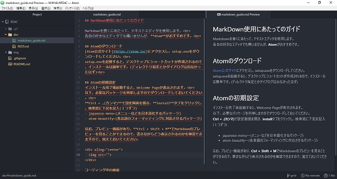
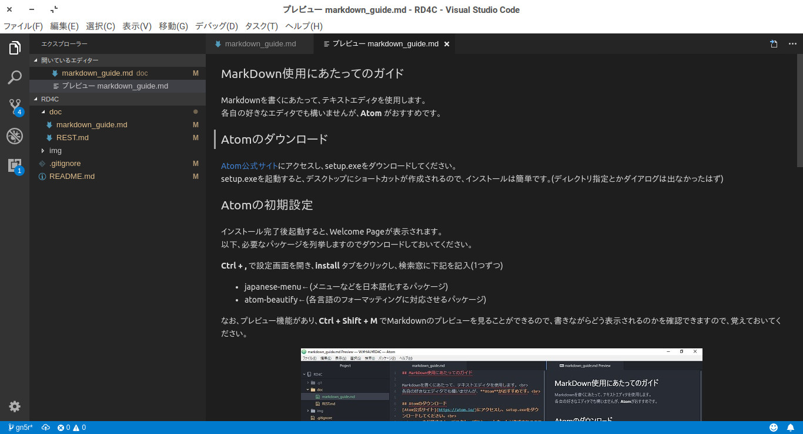

## MarkDown使用にあたってのガイド

Markdownを書くにあたって、テキストエディタを使用します。 
各自の好きなエディタでも構いませんが、**Atom** がおすすめです。 

## Atomのダウンロード
[Atom公式サイト](https://atom.io/)にアクセスし、setup.exeをダウンロードしてください。 
setup.exeを起動すると、デスクトップにショートカットが作成されるので、インストールは簡単です。(ディレクトリ指定とかダイアログは出なかったはず) 

## Atomの初期設定
インストール完了後起動すると、Welcome Pageが表示されます。 
以下、必要なパッケージを列挙しますのでダウンロードしておいてください。 

**Ctrl + ,** で設定画面を開き、**install** タブをクリックし、検索窓に下記を記入(１つずつ)
- japanese-menu←(メニューなどを日本語化するパッケージ)
- atom-beautify←(各言語のフォーマッティングに対応させるパッケージ)

なお、プレビュー機能があり、**Ctrl + Shift + M** でMarkdownのプレビューを見ることができるので、書きながらどう表示されるのかを確認できますので、覚えておいてください。

  

コーディング中の画面

## Visual Studio Codeでのやり方
調べてみたところ、Visual Studio Code(以後VSCode)でも同じことができることを確認しました。 
プレビューのショートカットキーである **`Ctrl + Shift + V`** を押すだけで、別タブにてプレビューが表示されます。 
こちらの方法では、パッケージをインストールする必要がなくショートカットキーを押すだけなので、VSCodeの方に慣れているのであればこちらでも構いません。 
ですが、Atomとは違い、プレビューショートカットだけでは画面分割されず、別タブに開いてしまうので、僕としては微妙な感じがします。 
また、画面分割のショートカットキーは **`Ctrl + \`** です。 

  

